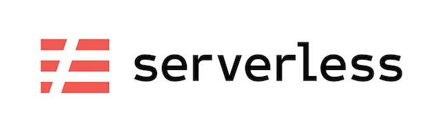

# deel77/serverless

Docker image (Slim) containing NodeJS 14.x, npm, AWS CLI, Serverless Framework v2.

### Notice

Heavily inspired by [amaysim/serverless](https://github.com/amaysim-au/docker-serverless) just it did not include npm package manager and using slim dist. 